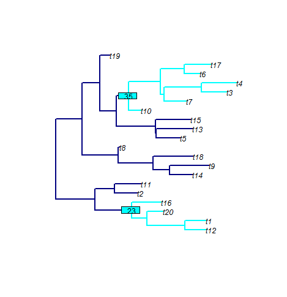

[](https://travis-ci.org/MichelleKendall/phyloTop)
[](https://cran.r-project.org/package=phyloTop)
[](http://cran.rstudio.com/web/packages/phyloTop/index.html)

*phyloTop*: Calculating Topological Properties of Phylogenies
========

*phyloTop* provides tools for calculating and viewing topological properties of phylogenetic trees.

Installing *phyloTop*
-------------
To install the development version from github:

```r
library(devtools)
install_github("michellekendall/phyloTop")
```

The stable version can be installed from CRAN using:

```r
install.packages("phyloTop")
```

Then, to load the package, use:

```r
library("phyloTop")
```

Content overview
-------------

The key functions available in *phyloTop* are:


#### Tree statistics and topological properties:

* __`avgLadder`__: find the average ladder size in a tree 

* __`cherries`__: find the number of cherries in a tree

* __`colless.phylo`__: find the Colless imbalance number of a tree

* __`getDepths`__: find the depth of each node in a tree 

* __`ILnumber`__: find the number of nodes with exactly one tip child

* __`ladderSizes`__: find the size of any "ladders" in a tree (consecutive nodes, each with exactly one tip child)

* __`maxHeight`__: find the maximum height (equivalently, depth) of nodes in a tree

* __`nConfig`__: find the sizes of all configurations (equivalently, clades) in a tree

* __`nodeDepth`__: find the depth of a given node in a tree

* __`nodeDepthFrac`__: find the fraction of nodes in a tree at a given depth

* __`nodeImb`__: find the imbalance of a given node in a tree

* __`nodeImbFrac`__: find the fraction of nodes in a tree with an imbalance of a given threshold or more

* __`phyloTop`__: find a range of tree statistics for a list of trees (faster than calling each function individually)

* __`pitchforks`__: find the number of pitchforks (clades of size three) in a tree

* __`sackin.phylo`__: find the Sackin index of a tree

* __`splitTop`__: find the split topology of a tree - the size of clades at a given depth

* __`stairs`__: find the "staircase-ness" measures, as defined by Norstrom et al. 2012

* __`treeImb`__: find the tree imbalance - the imbalance at each node

* __`widths`__: find the number of nodes at each depth in a tree


#### Tree visualisation tools:

* __`configShow`__: plot a tree, highlighting the configurations of a given size

* __`ladderShow`__: plot a tree, highlighting the "ladders"

* __`subtreeShow`__: plot a tree, highlighting the subtree(s) descending from the given node(s)


#### Simulating an epidemic and creating the corresponding genealogy:

* __`makeEpiRecord`__: simulate an epidemiological record of infectors, infectees, infection times and recovery times

* __`getLabGenealogy`__: create a genealogy from an epidemiological record


Examples
---------

#### Tree statistics:


Apply tree statistic functions to a list of 10 random trees, each with 50 tips:

```r
phyloTop(rmtree(10,50))
```

Example output:
```r
##   avgLadder cherries colless.phylo ILnumber maxHeight pitchforks sackin.phylo   stairs1    stairs2
## 1   3.000000       19    0.11139456       12        10          8          295 0.7755102 0.01576994
## 2   3.000000       12    0.13945578       26        11          7          308 0.6734694 0.01982611
## 3   2.000000       19    0.10289116       12        10          7          289 0.5918367 0.01719111
## 4   2.750000       17    0.08758503       16         9          6          277 0.5714286 0.01921548
## 5   3.000000       19    0.06207483       12         8          7          257 0.4489796 0.02279353
## 6   2.666667       16    0.19132653       18        13          8          365 0.3877551 0.01828405
## 7   2.000000       18    0.12414966       14        11          8          306 0.9591837 0.01403966
## 8   3.000000       18    0.08758503       14        11          9          271 0.4285714 0.02308904
## 9   2.500000       14    0.15051020       22        11         11          341 0.9795918 0.01062925
## 10  2.000000       17    0.14370748       16        12          8          321 0.2244898 0.02706817
```

#### Tree visualisation tools:

Plot a random tree with 20 tips, highlighting the the clade(s) descending from nodes 23 and 35:

```r
subtreeShow(rtree(20),nodeList=c(23,35), mainCol="navy", subtreeCol="cyan", nodeLabelCol="cyan", edge.width=2)
```

Example output:


